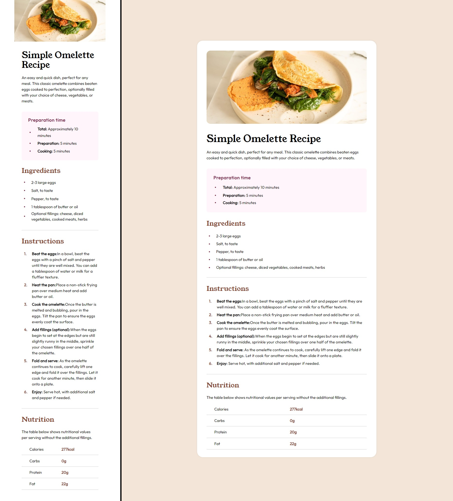

# Frontend Mentor - Recipe page 

## Welcome! 👋

This is a solution to the [Recipe page challenge on Frontend Mentor](https://www.frontendmentor.io/challenges/recipe-page-KiTsR8QQKm).

My challenge was to build out a <strong>recipe page</strong> and get it looking as close to the design as possible. I could use any tools I liked to help me complete the challenge. 

## Table of contents

- [Overview](#overview)
  - [The challenge](#the-challenge)
  - [Screenshot](#screenshot)
  - [Links](#links)
- [Author](#author)

## Overview

### The challenge

This challenge was a great opportunity for me to practice basic HTML and CSS tags.

### Screenshot

### Links

- Solution URL: [GITHUB SOURCE](https://github.com/pettik/FrontendMentor--recipe-page)
- Live Site URL: [LIVE SITE 🌐](https://pettik-recipe-page.netlify.app/)

## Author

- Website - [Petr Bednarski](https://github.com/pettik)
- Frontend Mentor - [@pettik](https://www.frontendmentor.io/profile/pettik)
